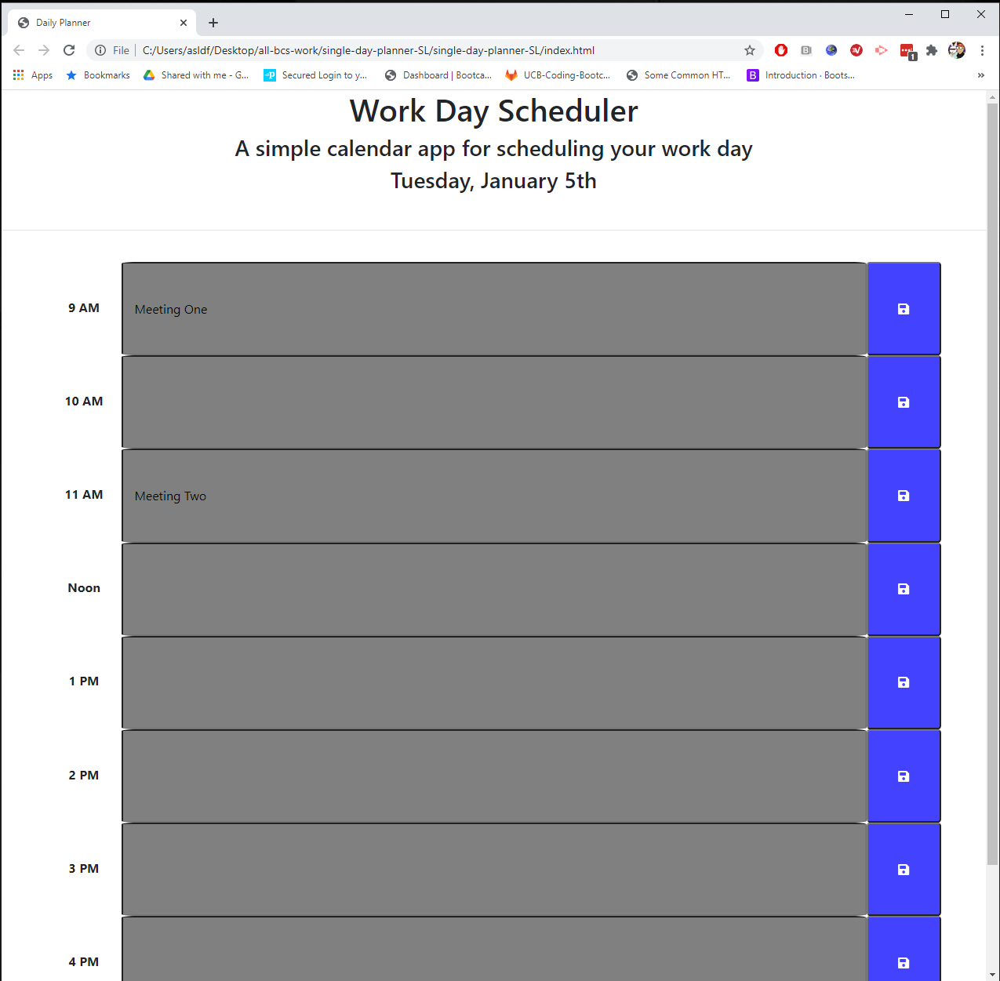

# Single Day Planner

## Summary

The ask was to create a planner that would cover a single work day, split out by hour, which a user could add meetings or other items to, save these items, and return to the page to see the items.  The planner should also display the current date, and each hour should display whether the hour has passed, is happening, or is in the future by changing color.

To accomplish this, the page was built out in HTML to provide the overall layout of the planner, then using a combination of the moment.js API (to get the current date and time) and jQuery to create, save to local storage, and display whatever items the user has input.

<hr>

## Example of Output


## Pseudo Code & Key Code Elements

Creating this scheduler required creating a number of items in the HTML that need to be touched by the javascript elements. This meant creating the HTML backbone, and including reference pointers that could be used to determine how the user is interacting with the page.

**Creating the HTML Backbone**

To create the HTML backbone, there were two main sections:
1. The Header
2. The Scheduler

Within the scheduler, there needed to be 9 separate input fields where the user could input information, as well as 9 corresponding save buttons.  For all nine of these input fields and save buttons, as well as the date in the header, we will need to create a way to access them in JS.

```
<row class="row">
    <div class="col-md-1">9 AM</div>
    <input id="timeslot09" class="col-md-10">
    <button id="button09" class="col-md-1 fas fa-save"></button>
</row>
```

Here I added the hour in 24 style, as this is how the moment.js API returns the current time.


**Calling the Date and Time**

The next major step is calling the date and time, which we do using the moment.js API. This provides us with the current date for the header, as well as a current hour that can be used in additional functions to change the color of each section of the schedule.


**Third Thing**


**Fourth Thing**


**Fifth Thing**

<hr>

## Built With

* [HTML](https://developer.mozilla.org/en-US/docs/Web/HTML)
* [CSS](https://developer.mozilla.org/en-US/docs/Web/CSS)
* [Javascript](https://developer.mozilla.org/en-us/docs/web/javascript)
* [Bootstrap](https://getbootstrap.com/)
* [jQuery](https://api.jquery.com/)
* [moment.js](https://momentjs.com/)

## Deployed Link

* [See Live Site](https://slimbeek6.github.io/single-day-planner-SL/)


## Authors

**Shaun Limbeek** 
- [Link to Portfolio](https://slimbeek6.github.io/SML_Portfolio/index.html)
- [Link to Github](https://github.com/slimbeek6/)
- [Link to LinkedIn](https://www.linkedin.com/in/shaun-limbeek/)